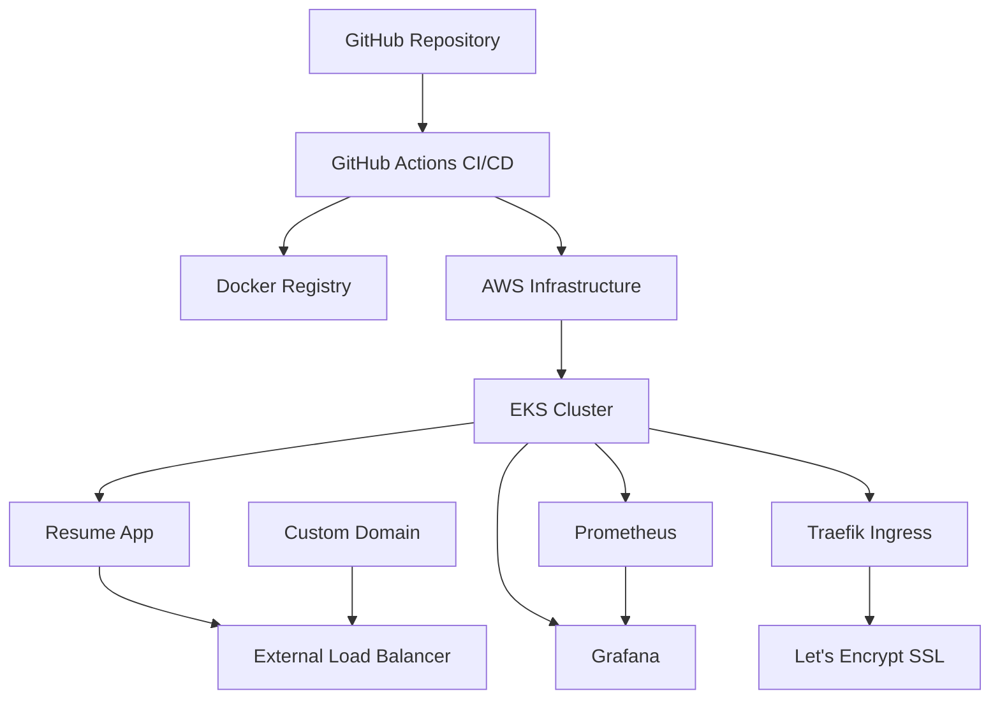

# DevOps Resume Platform

🚀 Полностью автоматизированная платформа для размещения резюме с CI/CD, Infrastructure as Code, мониторингом и GitOps.

## 📋 Описание проекта

Этот проект демонстрирует комплексные DevOps-навыки через создание персонального сайта-резюме, который:
- Автоматически деплоится через CI/CD
- Развертывается через Infrastructure as Code
- Мониторится и логируется
- Масштабируется в Kubernetes
- Обновляется через GitOps

## 🏗️ Архитектура



## 🛠️ Технологический стек

### Frontend
- HTML5, CSS3, JavaScript (ES6+)
- Responsive design
- Progressive Web App (PWA)

### Infrastructure
- **Cloud**: AWS (Free Tier)
- **IaC**: Terraform
- **Containerization**: Docker, Docker Compose
- **Orchestration**: Kubernetes (EKS)
- **Ingress**: Traefik
- **SSL**: Let's Encrypt

### CI/CD
- **Pipeline**: GitHub Actions
- **Registry**: Docker Hub / GitHub Container Registry
- **Deployment**: GitOps with ArgoCD

### Monitoring & Logging
- **Metrics**: Prometheus
- **Visualization**: Grafana
- **Logging**: Fluentd + CloudWatch
- **Health Checks**: Custom endpoints

### Security
- **Secrets**: AWS Secrets Manager
- **Network**: VPC, Security Groups
- **SSL/TLS**: Automated certificate management

## 📁 Структура проекта

```
devops-resume-platform/
├── app/                    # Веб-приложение
│   ├── src/               # Исходный код
│   ├── Dockerfile         # Docker образ
│   └── package.json       # Зависимости
├── terraform/             # Infrastructure as Code
│   ├── main.tf           # Основная конфигурация
│   ├── variables.tf      # Переменные
│   └── outputs.tf        # Выводы
├── k8s/                  # Kubernetes манифесты
│   ├── namespace.yaml    # Namespace
│   ├── deployment.yaml   # Deployment
│   ├── service.yaml      # Service
│   └── ingress.yaml      # Ingress
├── monitoring/           # Мониторинг
│   ├── prometheus/       # Prometheus конфигурация
│   └── grafana/          # Grafana дашборды
├── .github/              # GitHub Actions
│   └── workflows/        # CI/CD pipelines
├── docker-compose.yml    # Локальная разработка
└── README.md            # Документация
## 📊 Мониторинг

### Метрики
- **Uptime**: Доступность приложения
- **Response Time**: Время отклика
- **Resource Usage**: CPU, Memory, Disk
- **Error Rate**: Частота ошибок

### Дашборды
- **Application Overview**: Общий обзор приложения
- **Infrastructure**: Состояние инфраструктуры
- **Security**: Мониторинг безопасности

## 🔒 Безопасность

- HTTPS через Let's Encrypt
- Network policies в Kubernetes
- Минимальные IAM права
- Secrets management через AWS
- Регулярные обновления зависимостей

## 📈 CI/CD Pipeline

1. **Build**: Сборка Docker образа
2. **Test**: Запуск тестов и линтинга
3. **Security Scan**: Проверка уязвимостей
4. **Push**: Загрузка в registry
5. **Deploy**: Развертывание в Kubernetes
6. **Verify**: Проверка health checks

## 🌐 Live Demo

- **Production**: https://resume.yourdomain.com
- **Staging**: https://staging-resume.yourdomain.com
- **Monitoring**: https://grafana.yourdomain.com

## 📚 Документация

- [Архитектура](docs/architecture.md)
- [Развертывание](docs/deployment.md)
- [Мониторинг](docs/monitoring.md)
- [Troubleshooting](docs/troubleshooting.md)

## 🤝 Вклад в проект

1. Fork репозитория
2. Создайте feature branch
3. Внесите изменения
4. Создайте Pull Request

## 📄 Лицензия

MIT License - см. [LICENSE](LICENSE) файл.

## 📞 Контакты

- **Email**: twinleq@bk.ru
- **GitHub**: [@twinleq](https://github.com/twinleq)

---

⭐ Если проект вам понравился, поставьте звезду!


