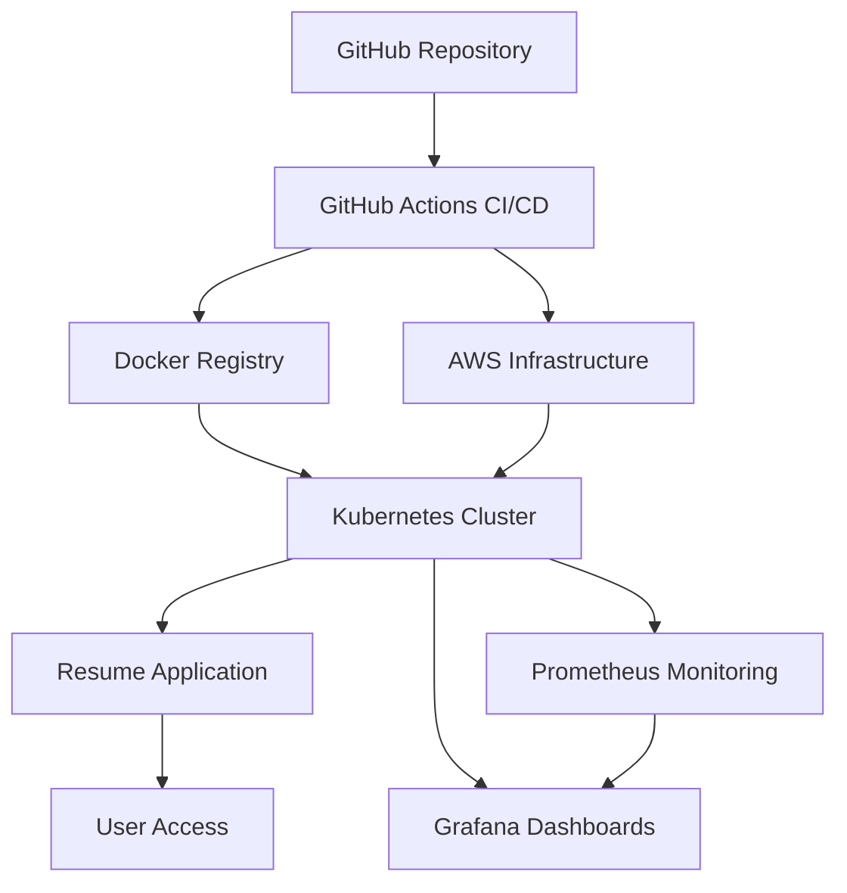

# DevOps Resume Platform

🚀 Полностью автоматизированная платформа для размещения резюме с CI/CD, Infrastructure as Code, мониторингом и GitOps.

## 📋 Описание проекта

Этот проект демонстрирует комплексные DevOps-навыки через создание персонального сайта-резюме, который:
- Автоматически деплоится через CI/CD
- Развертывается через Infrastructure as Code
- Мониторится и логируется
- Масштабируется в Kubernetes
- Обновляется через GitOps

## 🏗️ Архитектура



## 🛠️ Технологический стек

### Frontend
- **HTML5, CSS3, JavaScript** - современный веб-интерфейс
- **Responsive Design** - адаптивный дизайн
- **Progressive Web App** - PWA функциональность

### Backend & Infrastructure
- **Docker** - контейнеризация приложений
- **Kubernetes** - оркестрация контейнеров
- **Nginx** - reverse proxy и статика
- **Terraform** - Infrastructure as Code

### DevOps & Monitoring
- **GitHub Actions** - CI/CD автоматизация
- **Prometheus** - сбор метрик
- **Grafana** - визуализация данных
- **ELK Stack** - централизованное логирование

### Security
- **Network Policies** - сетевая безопасность
- **RBAC** - управление доступом
- **OPA Gatekeeper** - политики безопасности
- **Security Scanning** - сканирование уязвимостей

## 🚀 Быстрый старт

### Локальная разработка

```bash
# Клонирование репозитория
git clone https://github.com/twinleq/devops-resume-platform.git
cd devops-resume-platform

# Запуск локального сервера
cd app/src
./simple-server.ps1 -Port 8086
```

### Docker

```bash
# Запуск с Docker Compose
docker-compose up -d

# Проверка статуса
docker-compose ps
```

### Kubernetes

```bash
# Развертывание в Kubernetes
kubectl apply -f k8s/

# Проверка статуса
kubectl get pods -n devops-resume
```

### Terraform

```bash
# Инициализация Terraform
terraform init

# Планирование развертывания
terraform plan

# Развертывание инфраструктуры
terraform apply
```

## 📊 Мониторинг

### Health Checks
- **Endpoint**: `/health`
- **Response**: `{"status":"UP"}`
- **Frequency**: 30 секунд

### Metrics
- **Endpoint**: `/metrics`
- **Format**: Prometheus format
- **Uptime**: секунды работы

### Dashboards
- **Grafana**: http://localhost:3000
- **Prometheus**: http://localhost:9090

## 🔄 CI/CD Pipeline

### GitHub Actions Workflow
1. **Code Push** → Trigger
2. **Build** → Docker image
3. **Test** → Unit/Integration tests
4. **Security Scan** → Vulnerability check
5. **Deploy** → Production server
6. **Health Check** → Verify deployment
7. **Notify** → Success/Failure alerts

## 🔒 Безопасность

### Network Security
- Network Policies
- Pod Security Standards
- RBAC (Role-Based Access Control)

### Application Security
- HTTPS/TLS
- Content Security Policy
- Input Validation
- Secrets Management

## 📁 Структура проекта

```
devops-resume-platform/
├── app/                    # Веб-приложение
│   ├── src/               # Исходный код
│   ├── Dockerfile         # Docker образ
│   └── nginx.conf         # Nginx конфигурация
├── k8s/                   # Kubernetes манифесты
├── terraform/             # Terraform конфигурации
├── monitoring/            # Мониторинг (Prometheus, Grafana)
├── .github/workflows/     # GitHub Actions
├── docs/                  # Документация
└── security/              # Политики безопасности
```

## 📚 Документация

- [Архитектура](docs/architecture.md)
- [Развертывание](docs/deployment.md)
- [Мониторинг](docs/monitoring.md)
- [Устранение неполадок](docs/troubleshooting.md)

## 📄 Лицензия

MIT License - см. файл [LICENSE](LICENSE)

## 👨‍💻 Автор

**Ромадановский Виталий Денисович**
- GitHub: [@twinleq](https://github.com/twinleq)
- Email: twinleq@bk.ru