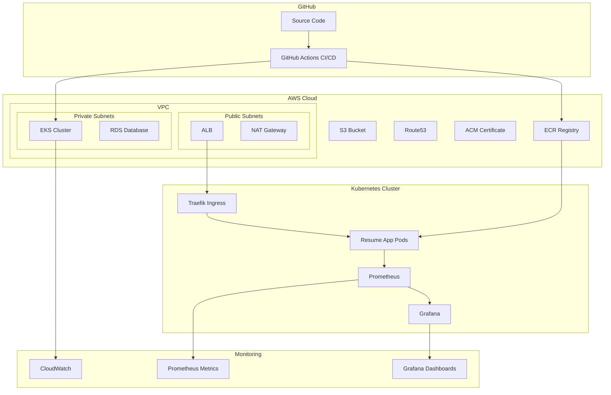

# Архитектура DevOps Resume Platform

## Обзор системы

DevOps Resume Platform представляет собой полноценную автоматизированную инфраструктуру для размещения персонального резюме с демонстрацией DevOps-навыков.

## Высокоуровневая архитектура



## Компоненты системы

### 1. Frontend Application
- **Технология**: HTML5, CSS3, JavaScript (ES6+)
- **Особенности**: 
  - Responsive design
  - Progressive Web App (PWA)
  - Health check endpoints
  - Metrics endpoints
- **Контейнеризация**: Docker с Nginx

### 2. Infrastructure as Code
- **Terraform**: Управление AWS ресурсами
- **Kubernetes**: Оркестрация контейнеров
- **Helm**: Управление приложениями в K8s

### 3. CI/CD Pipeline
- **GitHub Actions**: Автоматизация сборки и развертывания
- **Stages**:
  - Lint & Test
  - Security Scanning
  - Build & Push
  - Infrastructure Deployment
  - Application Deployment
  - Health Checks

### 4. Container Orchestration
- **Kubernetes**: EKS кластер в AWS
- **Features**:
  - Auto-scaling (HPA)
  - Rolling updates
  - Health checks
  - Resource limits
  - Network policies

### 5. Monitoring & Observability
- **Prometheus**: Сбор метрик
- **Grafana**: Визуализация
- **CloudWatch**: AWS мониторинг
- **Logging**: Structured logging

### 6. Security
- **Network Security**: VPC, Security Groups, Network Policies
- **Container Security**: Non-root containers, read-only filesystem
- **Secrets Management**: Kubernetes Secrets, AWS Secrets Manager
- **SSL/TLS**: Let's Encrypt через Traefik

## Поток данных

### 1. Развертывание
```
GitHub Push → GitHub Actions → Build Image → Push to ECR → Deploy to EKS
```

### 2. Трафик пользователей
```
User → Route53 → ALB → Traefik → Resume App Pod
```

### 3. Мониторинг
```
App Pod → Prometheus → Grafana Dashboard
```

## Масштабирование

### Горизонтальное масштабирование
- **HPA**: Автоматическое масштабирование на основе CPU/Memory
- **Cluster Autoscaler**: Масштабирование узлов кластера

### Вертикальное масштабирование
- **Resource Requests/Limits**: Управление ресурсами подов
- **Node Types**: Различные типы EC2 инстансов

## Безопасность

### Сетевая безопасность
- **VPC**: Изолированная сеть
- **Private Subnets**: Приложения в приватных подсетях
- **Security Groups**: Контроль трафика
- **Network Policies**: K8s сетевые политики

### Безопасность контейнеров
- **Non-root**: Контейнеры не работают от root
- **Read-only**: Read-only root filesystem
- **Capabilities**: Минимальные права
- **Security Context**: Ограничения безопасности

### Управление секретами
- **Kubernetes Secrets**: Локальные секреты
- **AWS Secrets Manager**: Облачные секреты
- **Encryption**: Шифрование в покое и транзите

## Резервное копирование

### Данные
- **ETCD**: Автоматические снимки EKS
- **Persistent Volumes**: EBS снимки
- **Configuration**: Git как источник истины

### Восстановление
- **Disaster Recovery**: Multi-AZ развертывание
- **RTO**: < 5 минут
- **RPO**: < 1 минута

## Стоимость оптимизации

### AWS Free Tier
- **EC2**: t3.micro инстансы
- **EBS**: 30GB бесплатно
- **Load Balancer**: Application Load Balancer
- **Data Transfer**: 1GB в месяц

### Автоматизация
- **Spot Instances**: Снижение стоимости на 90%
- **Auto-scaling**: Оптимизация ресурсов
- **Resource Scheduling**: Отключение в нерабочее время

## Мониторинг и алертинг

### Метрики
- **Application**: Response time, error rate, throughput
- **Infrastructure**: CPU, memory, disk, network
- **Business**: Uptime, availability, user satisfaction

### Алерты
- **Critical**: Service down, high error rate
- **Warning**: High resource usage, slow response
- **Info**: Deployment success, scaling events

## Disaster Recovery

### Backup Strategy
- **Code**: Git repository
- **Infrastructure**: Terraform state в S3
- **Data**: Automated EBS snapshots
- **Configuration**: Kubernetes manifests в Git

### Recovery Procedures
- **Infrastructure**: Terraform apply
- **Application**: Kubernetes deployment
- **Data**: EBS volume restore
- **DNS**: Route53 failover

## Производительность

### Оптимизации
- **CDN**: CloudFront для статики
- **Caching**: Nginx caching
- **Compression**: Gzip compression
- **Minification**: CSS/JS minification

### SLA
- **Uptime**: 99.9%
- **Response Time**: < 200ms
- **Availability**: 24/7

## Compliance

### Стандарты
- **Security**: OWASP Top 10
- **Privacy**: GDPR compliance
- **Accessibility**: WCAG 2.1 AA
- **Performance**: Core Web Vitals

### Аудит
- **Security Scanning**: Trivy, Snyk
- **Infrastructure Scanning**: Checkov, TFSec
- **Code Quality**: SonarQube, ESLint

