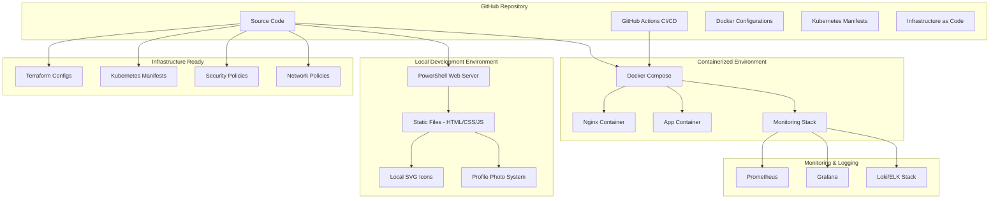

# Текущая архитектура DevOps Resume Platform

## Обзор системы

DevOps Resume Platform представляет собой полноценную автоматизированную инфраструктуру для размещения персонального резюме с демонстрацией DevOps-навыков. Проект включает в себя как локальную разработку, так и готовность к развертыванию в облаке.

## Реальная архитектура (Текущее состояние)



## Компоненты системы

### 1. **Локальная разработка**
- **PowerShell Web Server** (`simple-server.ps1`)
  - Порт: 8086
  - Поддержка статических файлов
  - Health check endpoint
  - Metrics endpoint
  - MIME types поддержка

### 2. **Статическое веб-приложение**
- **HTML** - структура сайта
- **CSS** - стили и анимации
- **JavaScript** - интерактивность и мониторинг
- **SVG иконки** - локальные файлы
- **Система фото** - автоматическое переключение placeholder/фото

### 3. **Контейнеризация**
- **Dockerfile** - оптимизированный образ
- **Docker Compose** - оркестрация сервисов
- **Nginx** - reverse proxy и статика
- **Multi-stage build** - оптимизация размера

### 4. **Оркестрация (Kubernetes)**
- **Namespace** - изоляция ресурсов
- **Deployment** - управление подами
- **Service** - сетевой доступ
- **Ingress** - внешний доступ
- **ConfigMap/Secret** - конфигурация
- **HPA** - автомасштабирование
- **NetworkPolicy** - безопасность сети

### 5. **Мониторинг**
- **Prometheus** - сбор метрик
- **Grafana** - визуализация
- **Alert Rules** - уведомления
- **Custom Metrics** - бизнес-метрики

### 6. **Infrastructure as Code**
- **Terraform** - управление инфраструктурой
- **Variables** - параметризация
- **Outputs** - экспорт значений
- **State management** - отслеживание состояния

### 7. **CI/CD Pipeline**
- **GitHub Actions** - автоматизация
- **Build & Test** - проверка качества
- **Security Scanning** - анализ безопасности
- **Dependency Updates** - обновление зависимостей
- **Deployment** - развертывание

## Технологический стек

### Frontend
- HTML5, CSS3, JavaScript (ES6+)
- Responsive Design
- Progressive Web App (PWA)
- Local SVG Icons

### Backend/Infrastructure
- PowerShell Web Server
- Docker & Docker Compose
- Kubernetes
- Nginx

### DevOps Tools
- Git & GitHub
- GitHub Actions
- Terraform
- Prometheus & Grafana
- ELK Stack

### Security
- Network Policies
- OPA Gatekeeper
- Security Scanning
- Secrets Management

## Развертывание

### Локальная разработка
```powershell
cd C:\Cursor\devops-resume-platform\app\src
.\simple-server.ps1 -Port 8086
```

### Docker
```bash
docker-compose up -d
```

### Kubernetes
```bash
kubectl apply -f k8s/
```

### Terraform
```bash
terraform init
terraform plan
terraform apply
```

## Мониторинг

### Health Checks
- **Endpoint**: `/health`
- **Response**: `{"status":"UP"}`
- **Frequency**: 30 секунд

### Metrics
- **Endpoint**: `/metrics`
- **Format**: Prometheus format
- **Uptime**: секунды работы

### Dashboards
- **Grafana**: http://localhost:3000
- **Prometheus**: http://localhost:9090

## Безопасность

### Network Security
- Network Policies
- Pod Security Standards
- RBAC (Role-Based Access Control)

### Application Security
- HTTPS/TLS
- Content Security Policy
- Input Validation
- Secrets Management

## Масштабирование

### Horizontal Pod Autoscaler (HPA)
- CPU: 70%
- Memory: 80%
- Min Pods: 2
- Max Pods: 10

### Resource Limits
- CPU: 100m - 500m
- Memory: 128Mi - 512Mi

## Backup & Recovery

### Configuration Backup
- Git repository
- ConfigMaps
- Secrets (encrypted)

### Data Backup
- Persistent Volumes
- Database backups
- Application state

## Development Workflow

1. **Code** → GitHub Repository
2. **Build** → GitHub Actions
3. **Test** → Automated Testing
4. **Deploy** → Kubernetes Cluster
5. **Monitor** → Prometheus/Grafana
6. **Alert** → Notification System
