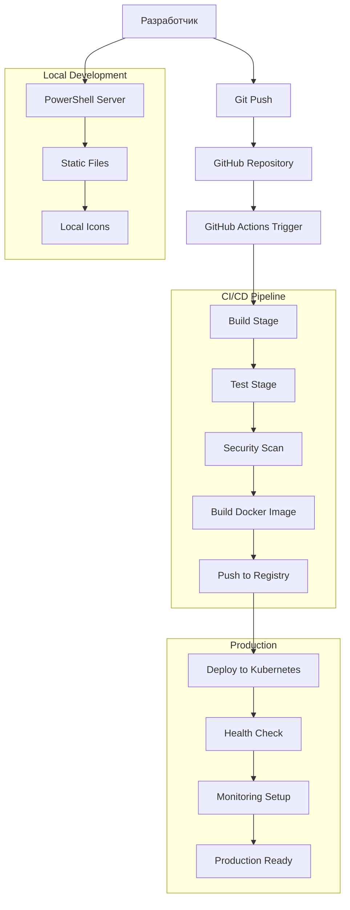
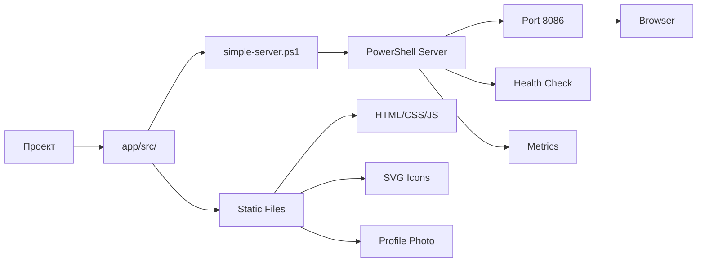
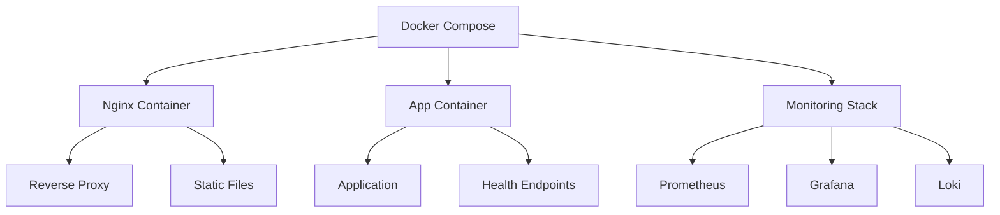
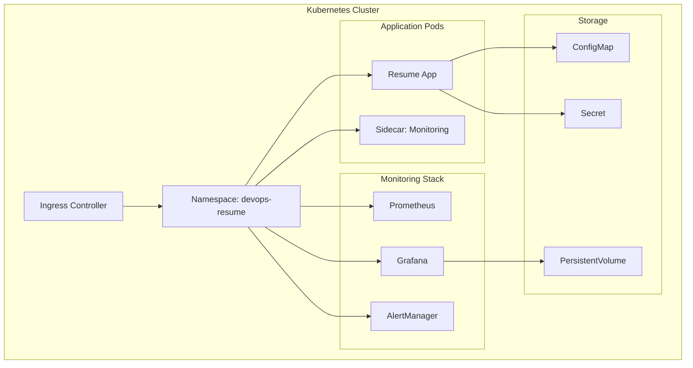
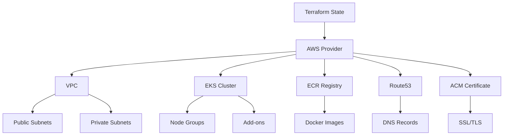
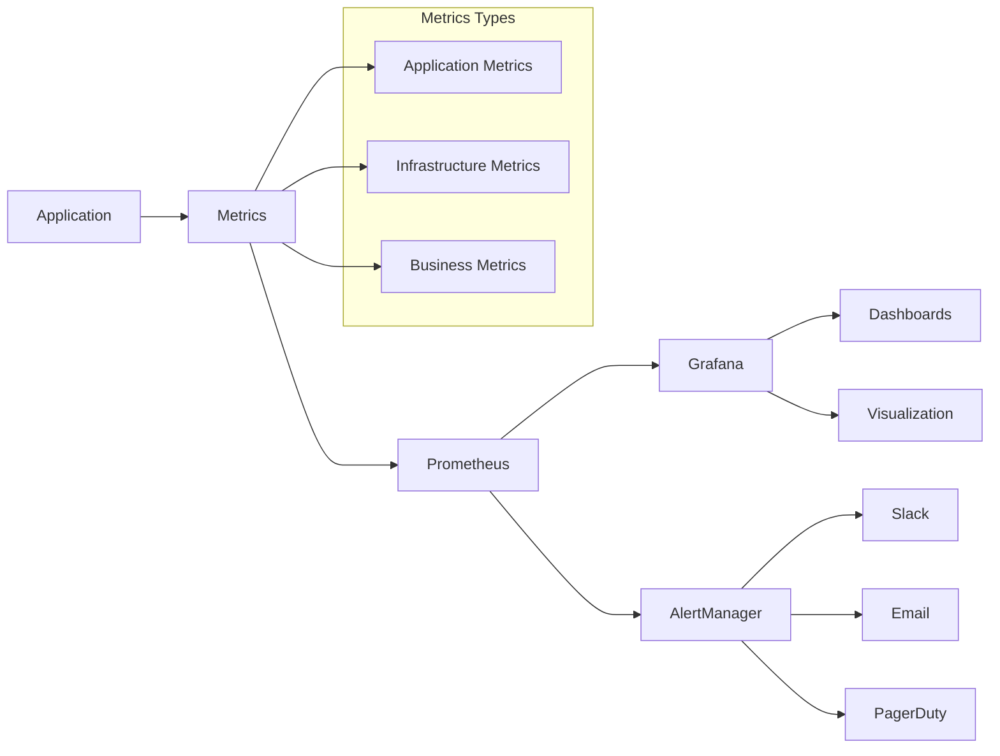
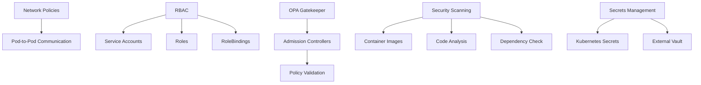
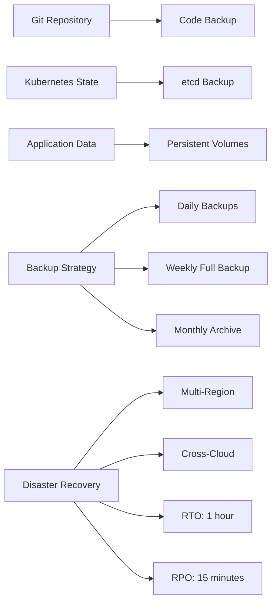

# Схема развертывания DevOps Resume Platform

## Поток развертывания

## Локальное развертывание

## Docker развертывание

## Kubernetes развертывание

## Terraform инфраструктура

## Мониторинг и алертинг

## Безопасность

## Backup и Disaster Recovery

