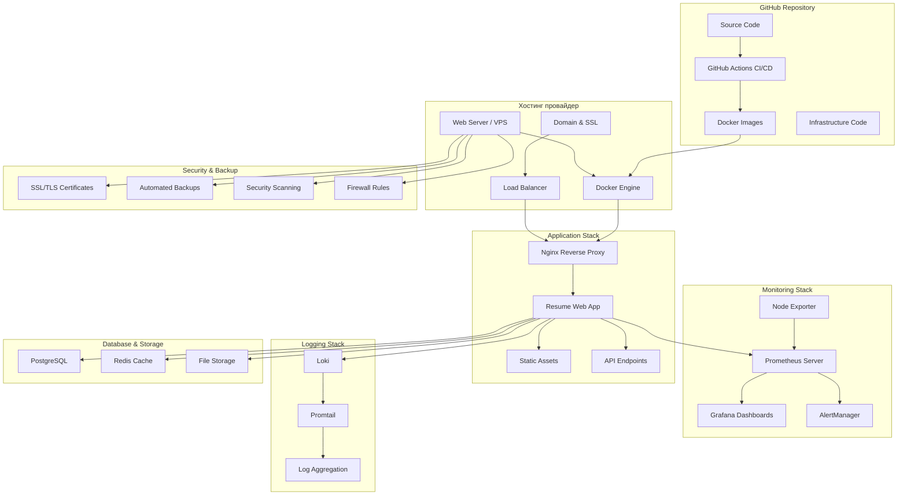

# Продакшн архитектура DevOps Resume Platform

## Обзор системы для хостинга

DevOps Resume Platform развертывается на реальном хостинге с полным мониторингом, Grafana дашбордами и всеми DevOps практиками.

## Реальная продакшн архитектура

## Компоненты системы

### 1. **Веб-сервер (Хостинг)**
- **VPS/Cloud Server** (Ubuntu/CentOS)
- **Docker Engine** для контейнеризации
- **Nginx** как reverse proxy
- **SSL/TLS** сертификаты (Let's Encrypt)
- **Domain** настроенный на сервер

### 2. **Приложение**
- **Resume Web App** в Docker контейнере
- **Nginx** для статических файлов
- **API endpoints** для мониторинга
- **Health checks** и metrics

### 3. **Мониторинг (Prometheus + Grafana)**
- **Prometheus** - сбор метрик
- **Grafana** - визуализация и дашборды
- **Node Exporter** - системные метрики
- **AlertManager** - уведомления

### 4. **Логирование**
- **Loki** - агрегация логов
- **Promtail** - сбор логов
- **Grafana** - просмотр логов

### 5. **База данных и кэш**
- **PostgreSQL** - основная БД
- **Redis** - кэширование
- **File Storage** - статические файлы

### 6. **Безопасность**
- **SSL/TLS** шифрование
- **Firewall** правила
- **Security scanning** в CI/CD
- **Automated backups**

## Технологический стек

### Frontend
- HTML5, CSS3, JavaScript
- Responsive Design
- Progressive Web App
- Local SVG Icons

### Backend
- Node.js/Express (опционально)
- Nginx
- Docker containers

### DevOps & Infrastructure
- Docker & Docker Compose
- GitHub Actions CI/CD
- Terraform (опционально)
- Prometheus & Grafana
- Loki & Promtail

### Database & Cache
- PostgreSQL
- Redis
- File system storage

### Security
- SSL/TLS (Let's Encrypt)
- Firewall (UFW/iptables)
- Container security
- Automated security scanning

## Развертывание на хостинге

### Варианты хостинга:
1. **VPS (Virtual Private Server)**
   - DigitalOcean Droplets
   - Linode
   - Vultr
   - Hetzner

2. **Cloud провайдеры**
   - AWS EC2
   - Google Cloud Compute
   - Azure Virtual Machines

3. **Managed хостинг**
   - Heroku
   - Railway
   - Render

### Рекомендуемая конфигурация VPS:
- **CPU**: 2 vCPU
- **RAM**: 4GB
- **Storage**: 40GB SSD
- **OS**: Ubuntu 22.04 LTS
- **Bandwidth**: 1TB/month

## Мониторинг и алертинг

### Prometheus метрики:
- Application uptime
- Response time
- Error rate
- System resources (CPU, RAM, Disk)
- Network traffic

### Grafana дашборды:
- **Application Dashboard** - метрики приложения
- **System Dashboard** - системные ресурсы
- **Infrastructure Dashboard** - инфраструктура
- **Business Dashboard** - бизнес-метрики

### Алерты:
- High error rate
- High response time
- Low disk space
- Service down
- High CPU/Memory usage

## Backup стратегия

### Автоматические бэкапы:
- **Database**: Daily PostgreSQL dumps
- **Application files**: Daily file system backup
- **Configuration**: Git repository
- **Monitoring data**: Prometheus data retention

### Восстановление:
- **RTO**: 1 час (Recovery Time Objective)
- **RPO**: 24 часа (Recovery Point Objective)

## Безопасность

### SSL/TLS:
- Let's Encrypt certificates
- Automatic renewal
- HTTPS redirect
- HSTS headers

### Firewall:
- UFW (Uncomplicated Firewall)
- Port restrictions
- SSH key authentication
- Fail2ban protection

### Container security:
- Non-root containers
- Security scanning
- Regular updates
- Minimal base images

## Масштабирование

### Горизонтальное масштабирование:
- Load balancer
- Multiple app instances
- Database replication
- CDN для статики

### Вертикальное масштабирование:
- CPU/RAM upgrade
- SSD storage upgrade
- Network bandwidth upgrade

## CI/CD Pipeline

### GitHub Actions workflow:
1. **Code Push** → Trigger
2. **Build** → Docker image
3. **Test** → Unit/Integration tests
4. **Security Scan** → Vulnerability check
5. **Deploy** → Production server
6. **Health Check** → Verify deployment
7. **Notify** → Success/Failure alerts

### Deployment strategy:
- **Blue-Green** deployment
- **Rolling updates**
- **Canary releases**
- **Feature flags**

## Стоимость хостинга

### VPS (рекомендуемый):
- **DigitalOcean**: $24/month (4GB RAM)
- **Linode**: $24/month (4GB RAM)
- **Vultr**: $24/month (4GB RAM)

### Дополнительные расходы:
- **Domain**: $10-15/year
- **SSL**: Free (Let's Encrypt)
- **Monitoring**: Free (self-hosted)

### Общая стоимость: ~$25-30/month
